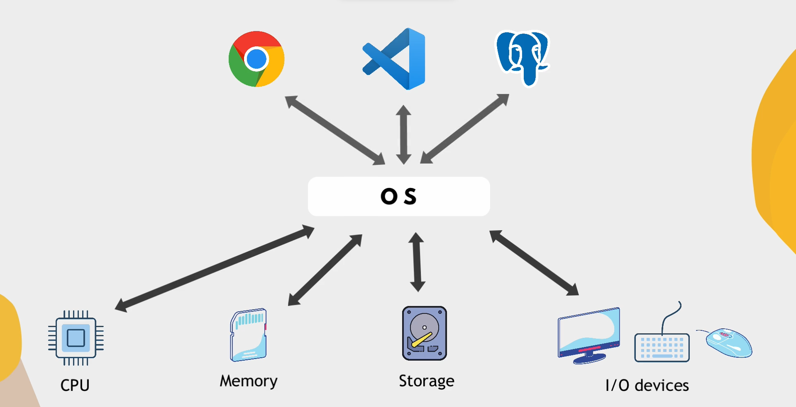
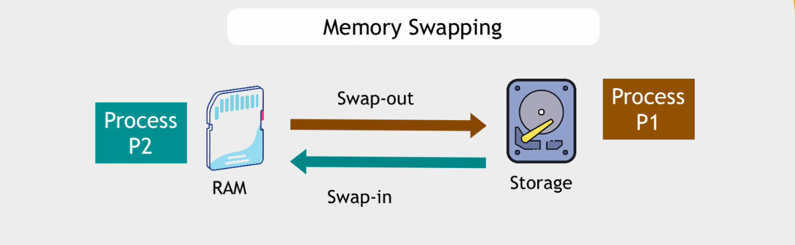

<h1 align="center">Introduction to Operating Systems 💻</h1>

#### What is an operating system ??
Consider your computer as a hub with various hardware devices—such as printers, keyboards, and monitors—each having its own unique language or way of functioning. However, if you were to transfer data from one device to an application, it wouldn't be practical to write specific code in each application for accessing and interacting with each hardware component.

This is where the Operating System (OS) comes in. Acting as an intermediary, the OS bridges the gap between these applications and the hardware. It essentially serves as a mediator that understands the intricacies of different hardware languages. When applications need to interact with hardware, they communicate with the OS, which then manages the complexities of interfacing with the hardware. This allows the applications to focus on their specific tasks without having to worry about the technical details of how to communicate with individual devices. It also acts as a translator between hardware and system.

### Tasks of an operating system

- **Process management**  - processes are basically tasks which are currently being performed in the system, for example opening chrome, creating new file etc.
- **Memory management** - allocating working memory, because every application needs memory to work. The working memory is called RAM, which stands for rapid access memory. Since RAM is only limited so if new process comes and no RAM then OS does memory swapping and gives the new process (P2) the memory to execute and stores the previous executing process (P1) to the storage

- **Storage and File Management** - Also called the secondary memory and used to store data for a long time or permanently. The files are stored in a hierarchy structure. 
- **Management of IO devices** 
- **Security and networking** - OS will manage users and permissions. Each user can log in separately and each of the users have their own space. And in networking, OS assigns ports and IP addresses.

## How an OS is constructed ?

The operating system is basically made on top of a program called as the kernel. It is the program which is loaded first when the computer is turned on. It is the heart of an operating system.
The kernel controls the interaction of CPU, Memory and RAM with the OS and the hardware.

It also controls the I/O devices connected to the system using the inbuilt device drivers. The device drivers basically control the device. For example when we consider the case of a printer, the device driver translates print commands from the OS into a format the printer understands, manages communication between the OS and the printer, sending formatted data to be printed, allows configuration of print settings like quality, paper size, etc. and keeps track of the printer's status and handles errors during printing.

The kernel acts as a layer between the application and the hardware. The kernel allocated resources to the app, that is it starts the process of the app and when the app is closed then it cleanups all the resources.

The most popular kernel is the Linux kernel which is used to build OS like Ubuntu, CentOS, Debian. These are different application layer but have the same kernel. The macOS uses a kernel named called Darwin.
The android is also based on Linux kernel.
There are also Operating systems for servers. More than half of the servers OS use Linux. They don't have a GUI, the interaction done in server OS is through the CLI (Command Line Interface). These servers OS are lightweight.
### macOS vs Linux

There is a similarity in between the macOS and the Linux. The reason is that the UNIX is the code base for both macOS and Linux.
Given below is the history of UNIX and from there you can spot the macOS and Linux (bottom left corner). 

Unix basically acts as the code base for different OS. The kernel of macOS Darwin is based on UNIX. Linux was developed in parallel to Unix based OS. The Linux is also built similar to UNIX, that is like a clone and hence it is called "UNIX like".
Linux and macOS both are POSIX (Portable OS Interface) compliant. These are the most popular standards out there and they keep the OS compatible.

### Linux for DevOps 

**Why Linux ?**
As I said before most of the server OS is written on Linux and since we are going to deal with servers like installing and configuring the servers, it is mandatory to use to learn the Linux.
And many technologies which we are Linux native technologies.

So, let's go ahead and learn Linux 🎯