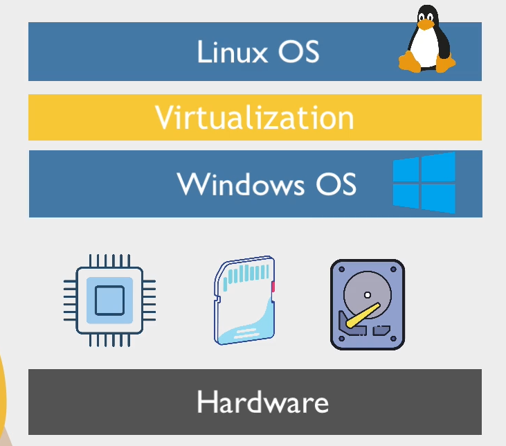
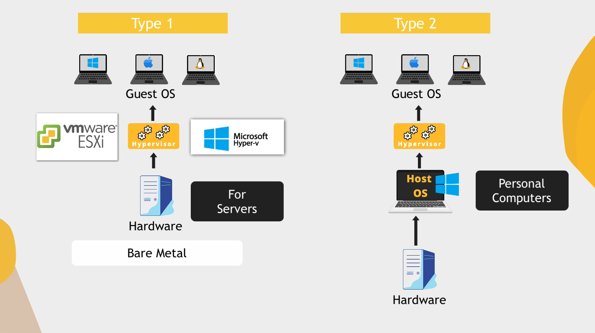

<h1 align="center">Introduction to Virtual Machine</h1>

### What is a virtual Machine ? 

Consider this case, I have a system and the OS which I am currently using is windows. So now if I have to use Linux, the way to make this happen is that I have to remove the windows and the installation of Linux on my system. But the help of virtualization I can make Linux OS run on top of this windows, that is I can use Linux without removing Windows. This is called virtualization, and the software which enables us to use multiple OS on a single hardware system is called a Virtual Machine. 

Virtualization software creates a virtual environment on your Windows system where you can install and run Linux as if it were a separate physical machine. This way, you can enjoy the benefits of both operating systems without the need to uninstall or modify your existing setup. It's a fantastic way to explore different operating systems, test software compatibility, or use specific tools unique to each OS without compromising your primary system.

The hardware resources are shared among the VM and the system, that is, it uses the systems' memory itself. The OS inside the VM and the host OS is completely isolated. If any problem occurs in the OS inside in the VM, it does not affect the host OS.

#### Some benefits of VM

- We can learn and experiment with different OS and try out many software programs on them without the fear that virus will get it or the system getting damaged.
- We can test applications on different operating systems and can know the working on each OS.

### What are hypervisors ?

A hypervisor is a software layer that enables the creation and management of virtual machines (VMs) on a physical machine. It's also known as a virtual machine monitor (VMM). Essentially, the hypervisor sits between the hardware of the physical computer and the virtual machines that run on it.

There are two main types of hypervisors:

-  **Type 1 Hypervisor (Bare Metal Hypervisor):** This type runs directly on the physical hardware without the need for a host operating system. It manages the hardware resources and facilitates the creation and operation of multiple VMs. Examples include VMware ESXi, Microsoft Hyper-V (in its standalone form), and Xen.

- **Type 2 Hypervisor (Hosted Hypervisor):** This type runs on top of a host operating system. It requires the host OS to provide some resources and functionalities, and then it creates and manages VMs within that environment. Examples include VMware Workstation, Oracle VirtualBox, and Parallels Desktop.

When instances or VMs are created on a Type 1 hypervisor, each of them is completely isolated from the others. This isolation means that if one instance gets hacked or experiences a security issue, it won't affect the other instances. They operate independently, like separate compartments in a building. This isolation is vital for security in cloud computing, ensuring that problems in one instance don't spread to impact others, maintaining the overall stability of the system. That is why the Type 1 hypervisors are used by the major tech companies.

### What are the benefits of companies using the virtualization ?

- **Efficient Use of Hardware Resources:** Virtualization allows for better utilization of physical server hardware. Instead of having one operating system per server, virtualization enables multiple virtual machines to run on a single physical server. This consolidation optimizes resource usage, reducing the need for additional hardware and lowering operational costs.

- **Improved Server Utilization:** By running multiple virtual machines on a single physical server, companies can make better use of their server infrastructure. This leads to higher server consolidation ratios, meaning fewer physical servers are needed to run the same workload. It translates to cost savings in terms of power consumption, cooling, and physical space.

-  **Abstraction of OS from Hardware:** Virtualization abstracts the operating system (OS) from the underlying hardware. This abstraction enables greater flexibility in deploying and managing various operating systems on the same physical infrastructure. It allows for easier migration, backup, and recovery of virtual machines, regardless of the underlying hardware, enhancing overall agility and reducing dependency on specific hardware configurations.

-  **Enhanced Flexibility and Scalability:** Virtualization provides the flexibility to dynamically allocate resources to virtual machines as needed. Companies can scale up or down their virtual infrastructure based on demand, allocating more resources to critical applications during peak times and reallocating resources when the demand decreases, promoting agility and responsiveness.

-  **Simplified Management and Maintenance:** Centralized management tools in virtualization simplify the administration of virtualized environments. It streamlines tasks such as provisioning new VMs, monitoring performance, and managing updates or patches, reducing administrative overhead and enhancing overall system manageability.

So let's dive into the Linux basics in the upcoming module, see ya 👋